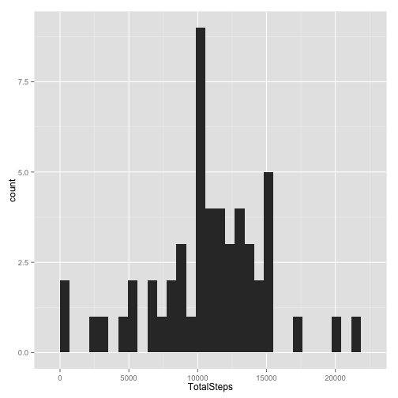
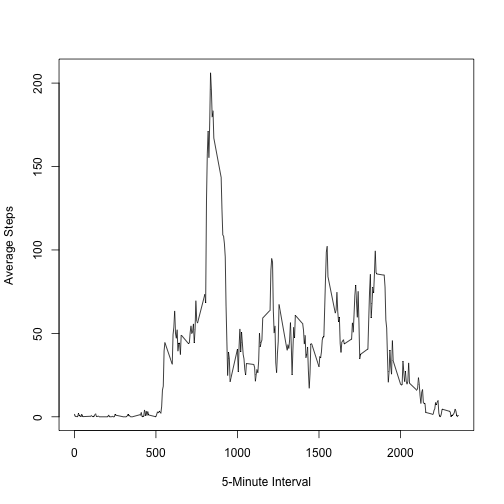
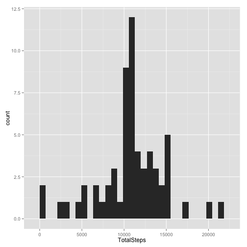
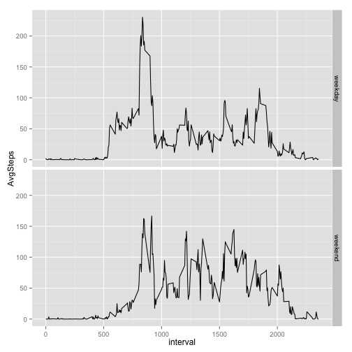

---
output:
  html_document:
    keep_md: yes
---

##Loading and preprocessing the data


```r
##Read data from file
df <- read.csv("./activity.csv", header = TRUE, sep = ",", na.strings = "NA")
##Change class of date from string to date
df$date <- as.Date(df$date)
```

##What is mean total number of steps taken per day?


```r
##Calculate total daily steps per day
library(dplyr)
df_daily_steps <- df %>% group_by(date) %>% summarize(sum(steps))
names(df_daily_steps) <- c("date","TotalSteps")
```

####Histogram of the total number of steps taken each day


```r
##Use ggplot2 to plot histogram
library(ggplot2)
qplot(TotalSteps, data = df_daily_steps, geom = "histogram")
```

```
## stat_bin: binwidth defaulted to range/30. Use 'binwidth = x' to adjust this.
```

 

```r
##Calculate Mean and Median
dfMean <- mean(df_daily_steps$TotalSteps, na.rm = TRUE)
dfMedian <- median(df_daily_steps$TotalSteps, na.rm = TRUE)
```

####Below is the mean of the total number of steps taken per day.

```r
dfMean
```

```
## [1] 10766.19
```

####Below is the median of the total number of steps taken per day.

```r
dfMedian
```

```
## [1] 10765
```


##What is the average daily activity pattern?

####Time series plot of the 5-minute interval and the average number of steps taken.


```r
##Calculate average number of steps taken per time interval through all days
df_by_time <- data.frame(df %>% group_by(interval) %>% summarize(mean(steps, na.rm = TRUE)))
##Assign proper column name
names(df_by_time) <- c("interval","AvgSteps")
##Use base plotting to create time-series plot
plot(df_by_time$interval, df_by_time$AvgSteps, type = "l", xlab = "5-Minute Interval", ylab = "Average Steps")
```

 

####Below is the 5-minute interval that contains maximum number of steps.

```r
df_by_time[df_by_time$AvgSteps == max(df_by_time$AvgSteps),]$interval
```

```
## [1] 835
```

##Imputing missing values

####Total number of missing values in the dataset is shown below.


```r
nrow(df[is.na(df$steps),])
```

```
## [1] 2304
```

####Strategy: Using average number of steps taken at each 5-minute interval to fill in all of the missing values


```r
##Create new data frame "df_filled" for filling missing data
df_filled <- df
##Find row position of data that has NA steps
RowNA <- grep(TRUE, is.na(df$steps))
##Seperate those data with NA steps into new data frame called "df_filled_select"
df_filled_select <- df_filled[RowNA,]
##Link it with average number of steps taken from data frame "df_by_time"
df_filled_select <- merge(df_filled_select,df_by_time,by.x = "interval", by.y = "interval", all.x = TRUE, all.y = FALSE)
##Sort merged data into right order
df_filled_select <- df_filled_select[order(df_filled_select$date, df_filled_select$interval),]
##Fill data back into "df_filled"
df_filled[RowNA,]$steps <- df_filled_select$AvgSteps
```

####Histogram of the total number of steps taken each day


```r
##Calculate total number of steps taken per day
df_filled2 <- df_filled %>% group_by(date) %>% summarize(sum(steps))
##Assign proper column name
names(df_filled2) <- c("date","TotalSteps")
##Use ggplot2 system to create histogram
qplot(TotalSteps, data = df_filled2, geom = "histogram")
```

```
## stat_bin: binwidth defaulted to range/30. Use 'binwidth = x' to adjust this.
```

 

```r
##Calculate mean and median
df_filled2_Mean <- mean(df_filled2$TotalSteps, na.rm = TRUE)
df_filled2_Median <- median(df_filled2$TotalSteps, na.rm = TRUE)
```

####Below is the mean of the total number of steps taken per day.

```r
df_filled2_Mean
```

```
## [1] 10766.19
```

####Below is the median of the total number of steps taken per day.

```r
df_filled2_Median
```

```
## [1] 10766.19
```

We can see that imputing missing data does not affect the calculation of mean (given that the first calculation neglects record with NA step). However, this imputing does affect the calculation of median. After imputing, median increases slightly.

##Are there differences in activity patterns between weekdays and weekends?


```r
##Add new column "weekvar" (factor) based on date. This "weekvar" represents whether the date is the weekday or weekend.
df_filled$weekvar <- factor(ifelse(weekdays(df_filled$date)=="Saturday"|weekdays(df_filled$date)=="Sunday","weekend","weekday"), labels = c("weekday","weekend"))
##Calculate average number of steps per time interval
df_filled_weekvar <- df_filled %>% group_by(interval,weekvar) %>% summarize(mean(steps, na.rm = TRUE))
##Assign proper column name
names(df_filled_weekvar) <- c("interval", "weekvar", "AvgSteps")
##Use ggplot2 system to plot time series (type "l")
qplot(interval,AvgSteps,data = df_filled_weekvar, facets = weekvar~., geom = "line")
```

 

Based on the plot above, we can summarize that there is indeed a difference in activity pattern between weekdays and weekends. The highest average number of steps taken during weekend is less than during weekday. Also, it seems that there are more average number of steps taken in the evening during weekend than during weekday.


